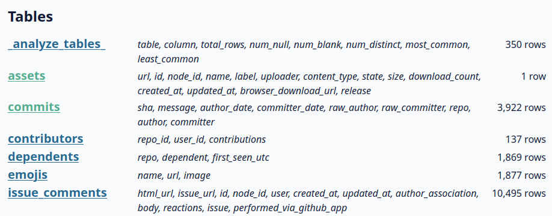

[](https://github.com/commongeek/tables-as-table/releases)
[](https://github.com/commongeek/tables-as-table/blob/main/LICENSE)

# datasette-tables-as-table
A CSS plugin for Datasette that displays a list of database tables as a table rather than a list.

## Requirements
Requires Datesette version >= 1.0a16. It won't work with 0.65 and earlier. It may work with earlier versions of 1.0 but it has not been checked.

## Installation
The plugin is single-file and 100% CSS, so no installation via PyPI packages is required. Just add a link to your Datasette configuration:

- if you use YAML format:
```yaml
extra_css_urls:
- https://cdn.jsdelivr.net/gh/commongeek/datasette-tables-as-table@latest/main.css
```

- if you use JSON format:
```json
  "extra_css_urls": [
    "https://cdn.jsdelivr.net/gh/commongeek/datasette-tables-as-table@latest/main.css"
  ]
```
## Screenshot

